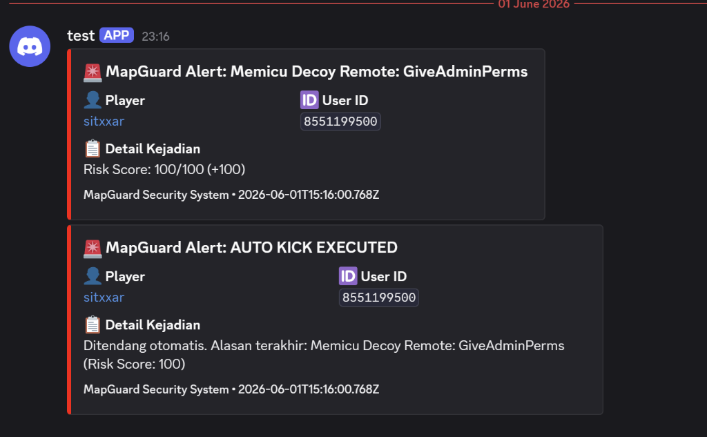
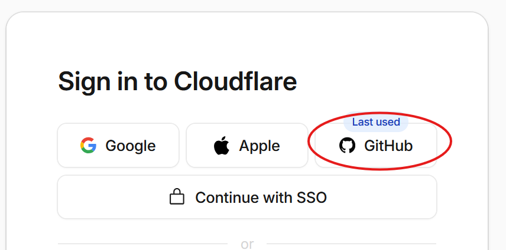
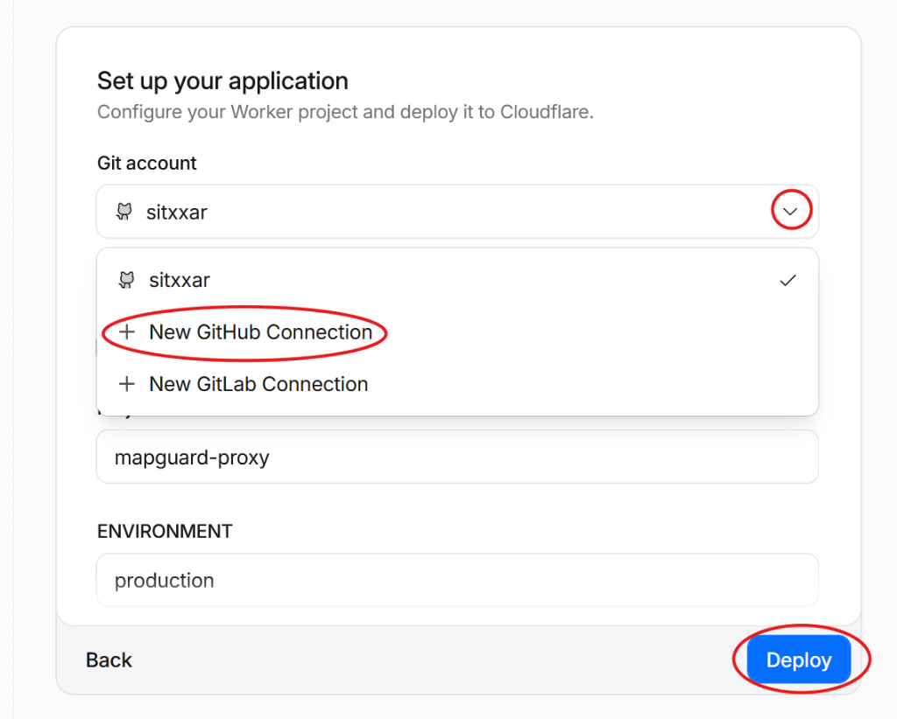
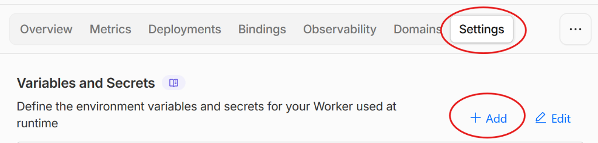
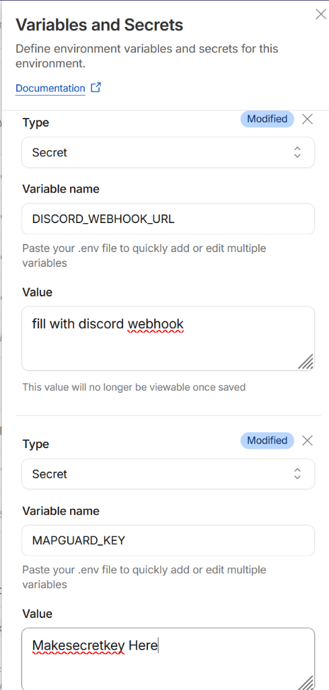
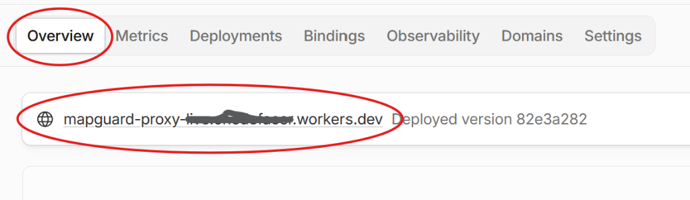

# MapGuard Webhook Proxy

A secure, rate-limit resilient middleware proxy for Roblox game experiences. It groups (batches) and deduplicates security logs sent from Roblox game servers and forwards them to a Discord Webhook, preventing Roblox `HttpService` limits and Discord HTTP `429 Too Many Requests` blockages.

## 📺 Discord Alert Demo

Here is a visual example of how MapGuard bundles alerts in your Discord channel:

## 🚀 1-Click Deploy to Cloudflare Workers

Follow these steps to deploy your proxy in under a minute without using any command line interfaces:

### Prerequisites
1. A **GitHub Account** (Free). If you don't have one, sign up at [github.com](https://github.com).
2. A **Cloudflare Account** (Free). Sign up at [cloudflare.com](https://cloudflare.com).

### Deployment Guide

1. Click the **Deploy to Cloudflare Workers** button below:

2. If prompted to sign in to Cloudflare, select **GitHub** to sign in:
   

3. Under **Git account**, click the dropdown and select **+ New GitHub Connection** to link your GitHub profile. Once authorized, select your username and click the blue **Deploy** button:
   

4. Wait about 10-15 seconds for Cloudflare to fork the repository and deploy the worker.

---

## ⚙️ Environment Variables Configuration

Once deployment is complete, go to your Cloudflare Workers Dashboard, select your project, and follow these steps:

1. Click on the **Settings** tab in the top menu and select **Variables and Secrets**. Click the **+ Add** button:
   

2. Add the following two variables (choose type **Secret**):
   * **`DISCORD_WEBHOOK_URL`**
     * **Description:** Your Discord channel Webhook URL where alerts will be sent.
   * **`MAPGUARD_KEY`**
     * **Description:** A secret security key of your choice to authorize HTTP requests sent from the Roblox game server.

   

3. After saving the variables, go back to the **Overview** tab in the top menu and copy your public **Worker URL**:
   

Finally, click **Save and Deploy** after adding the variables. Copy your Worker URL (e.g., `https://mapguard-proxy-live.username.workers.dev/v1/alerts` by appending `/v1/alerts` to your Overview URL) and paste it into the Roblox configuration file `Config.lua`.
